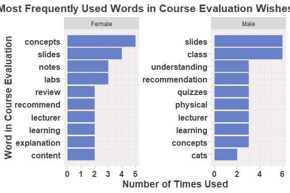
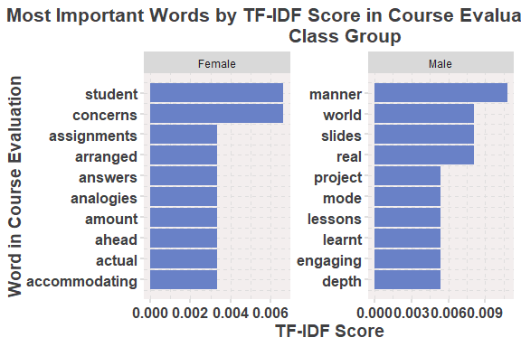
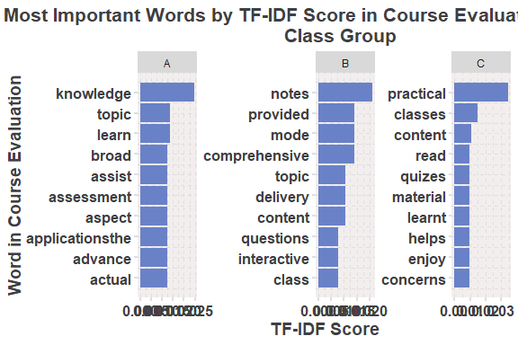
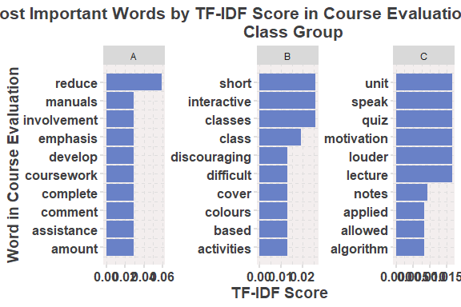

Business Intelligence Lab Submission Markdown
================
korn
8/10/23

- [Student Details](#student-details)
- [Setup Chunk](#setup-chunk)
- [Loading the Student Performance
  Dataset](#loading-the-student-performance-dataset)
  - [Description of the Dataset](#description-of-the-dataset)
- [Average rating per gender and per
  group](#average-rating-per-gender-and-per-group)
  - [Word Count.](#word-count)
  - [TOP 10 WORDS PER GENDER (LIKES)](#top-10-words-per-gender-likes)
  - [TOP 10 WORDS PER GENDER (WISHES)](#top-10-words-per-gender-wishes)
  - [MOST IMPORTANT WORDS BY TF-IDF SCORE IN COURSE EVALUATION CLASS
    GROUP
    (LIKES)](#most-important-words-by-tf-idf-score-in-course-evaluation-class-group-likes)
  - [MOST IMPORTANT WORDS BY TF-IDF SCORE IN COURSE EVALUATION CLASS
    GROUP
    (WISHES)](#most-important-words-by-tf-idf-score-in-course-evaluation-class-group-wishes)

# Student Details

<table>
<colgroup>
<col style="width: 53%" />
<col style="width: 46%" />
</colgroup>
<tbody>
<tr class="odd">
<td><strong>Student ID Numbers and Names of Group Members</strong></td>
<td><ol type="1">
<li><p>134644 - C - Sebastian Muramara</p></li>
<li><p>136675 - C - Bernard Otieno</p></li>
<li><p>131589 - C - Agnes Anyango</p></li>
<li><p>131582 - C - Njeri Njuguna</p></li>
<li><p>136009 - C- Sera Ndabari</p></li>
</ol></td>
</tr>
<tr class="even">
<td><strong>GitHub Classroom Group Name</strong></td>
<td>Korn</td>
</tr>
<tr class="odd">
<td><strong>Course Code</strong></td>
<td>BBT4206</td>
</tr>
<tr class="even">
<td><strong>Course Name</strong></td>
<td>Business Intelligence II</td>
</tr>
<tr class="odd">
<td><strong>Program</strong></td>
<td>Bachelor of Business Information Technology</td>
</tr>
<tr class="even">
<td><strong>Semester Duration</strong></td>
<td>21<sup>st</sup> August 2023 to 28<sup>th</sup> November 2023</td>
</tr>
</tbody>
</table>

# Setup Chunk

We start by installing all the required packages

``` r
## formatR - Required to format R code in the markdown ----
if (!is.element("formatR", installed.packages()[, 1])) {
  install.packages("formatR", dependencies = TRUE,
                   repos="https://cloud.r-project.org")
}
require("formatR")


## dplyr - For data manipulation ----
if (!is.element("dplyr", installed.packages()[, 1])) {
  install.packages("dplyr", dependencies = TRUE,
  repos = "https://cloud.r-project.org")
}
require("dplyr")

## ggplot2 - For data visualizations using the Grammar for Graphics package ----
if (!is.element("ggplot2", installed.packages()[, 1])) {
install.packages("ggplot2", dependencies = TRUE,
repos = "https://cloud.r-project.org")
}
require("ggplot2")

## ggrepel - Additional options for the Grammar for Graphics package ----
if (!is.element("ggrepel", installed.packages()[, 1])) {
install.packages("ggrepel", dependencies = TRUE,
repos = "https://cloud.r-project.org")
}
require("ggrepel")

## ggraph - Additional options for the Grammar for Graphics package ----
if (!is.element("ggraph", installed.packages()[, 1])) {
install.packages("ggraph", dependencies = TRUE,
repos = "https://cloud.r-project.org")
}
require("ggraph")

## tidytext - For text mining ----
if (!is.element("tidytext", installed.packages()[, 1])) {
install.packages("tidytext", dependencies = TRUE,
repos = "https://cloud.r-project.org")
}
require("tidytext")

## tidyr - To tidy messy data ----
if (!is.element("tidyr", installed.packages()[, 1])) {
install.packages("tidyr", dependencies = TRUE,
repos = "https://cloud.r-project.org")
}
require("tidyr")

## widyr - To widen, process, and re-tidy a dataset ----
if (!is.element("widyr", installed.packages()[, 1])) {
install.packages("widyr", dependencies = TRUE,
repos = "https://cloud.r-project.org")
}
require("widyr")

## gridExtra - to arrange multiple grid-based plots on a page ----
if (!is.element("gridExtra", installed.packages()[, 1])) {
install.packages("gridExtra", dependencies = TRUE,
repos = "https://cloud.r-project.org")
}
require("gridExtra")

## knitr - for dynamic report generation ----
if (!is.element("knitr", installed.packages()[, 1])) {
install.packages("knitr", dependencies = TRUE,
repos = "https://cloud.r-project.org")
}
require("knitr")

## kableExtra - for nicely formatted output tables ----
if (!is.element("kableExtra", installed.packages()[, 1])) {
install.packages("kableExtra", dependencies = TRUE,
repos = "https://cloud.r-project.org")
}
require("kableExtra")

## formattable -  To create a formattable object ----
# A formattable object is an object to which a formatting function and related
# attributes are attached.
if (!is.element("formattable", installed.packages()[, 1])) {
install.packages("formattable", dependencies = TRUE,
repos = "https://cloud.r-project.org")
}
require("formattable")

## circlize - To create a cord diagram or visualization ----
# by Gu et al. (2014)
if (!is.element("circlize", installed.packages()[, 1])) {
install.packages("circlize", dependencies = TRUE,
repos = "https://cloud.r-project.org")
}
require("circlize")
```

------------------------------------------------------------------------

**Note:** the following “*KnitR*” options have been set as the defaults
in this markdown:  
`knitr::opts_chunk$set(echo = TRUE, warning = FALSE, eval = TRUE, collapse = FALSE, tidy.opts = list(width.cutoff = 80), tidy = TRUE)`.

More KnitR options are documented here
<https://bookdown.org/yihui/rmarkdown-cookbook/chunk-options.html> and
here <https://yihui.org/knitr/options/>.

``` r
knitr::opts_chunk$set(
    eval = TRUE,
    echo = TRUE,
    warning = FALSE,
    collapse = FALSE,
    tidy = TRUE
)
```

------------------------------------------------------------------------

**Note:** the following “*R Markdown*” options have been set as the
defaults in this markdown:

> output:  
>   
> github_document:  
> toc: yes  
> toc_depth: 4  
> fig_width: 6  
> fig_height: 4  
> df_print: default  
>   
> editor_options:  
> chunk_output_type: console

# Loading the Student Performance Dataset

The 20230412-20230719-BI1-BBIT4-1-StudentPerformanceDataset is then
loaded. The dataset and its metadata are available here:
<https://drive.google.com/drive/folders/1-BGEhfOwquXF6KKXwcvrx7WuZXuqmW9q?usp=sharing>

``` r
student_performance_dataset <-
  readr::read_csv(
                  "../data/20230412-20230719-BI1-BBIT4-1-StudentPerformanceDataset.CSV", # nolint

                  col_types =
                  readr::cols(
                              class_group =
                              readr::col_factor(levels = c("A", "B", "C")),
                              gender = readr::col_factor(levels = c("1", "0")),
                              YOB = readr::col_date(format = "%Y"),
                              regret_choosing_bi =
                              readr::col_factor(levels = c("1", "0")),
                              drop_bi_now =
                              readr::col_factor(levels = c("1", "0")),
                              motivator =
                              readr::col_factor(levels = c("1", "0")),
                              read_content_before_lecture =
                              readr::col_factor(levels =
                                                c("1", "2", "3", "4", "5")),
                              anticipate_test_questions =
                              readr::col_factor(levels =
                                                c("1", "2", "3", "4", "5")),
                              answer_rhetorical_questions =
                              readr::col_factor(levels =
                                                c("1", "2", "3", "4", "5")),
                              find_terms_I_do_not_know =
                              readr::col_factor(levels =
                                                c("1", "2", "3", "4", "5")),
                              copy_new_terms_in_reading_notebook =
                              readr::col_factor(levels =
                                                c("1", "2", "3", "4", "5")),
                              take_quizzes_and_use_results =
                              readr::col_factor(levels =
                                                c("1", "2", "3", "4", "5")),
                              reorganise_course_outline =
                              readr::col_factor(levels =
                                                c("1", "2", "3", "4", "5")),
                              write_down_important_points =
                              readr::col_factor(levels =
                                                c("1", "2", "3", "4", "5")),
                              space_out_revision =
                              readr::col_factor(levels =
                                                c("1", "2", "3", "4", "5")),
                              studying_in_study_group =
                              readr::col_factor(levels =
                                                c("1", "2", "3", "4", "5")),
                              schedule_appointments =
                              readr::col_factor(levels =
                                                c("1", "2", "3", "4", "5")),
                              goal_oriented =
                              readr::col_factor(levels =
                                                c("1", "0")),
                              spaced_repetition =
                              readr::col_factor(levels =
                                                c("1", "2", "3", "4")),
                              testing_and_active_recall =
                              readr::col_factor(levels =
                                                c("1", "2", "3", "4")),
                              interleaving =
                              readr::col_factor(levels =
                                                c("1", "2", "3", "4")),
                              categorizing =
                              readr::col_factor(levels =
                                                c("1", "2", "3", "4")),
                              retrospective_timetable =
                              readr::col_factor(levels =
                                                c("1", "2", "3", "4")),
                              cornell_notes =
                              readr::col_factor(levels =
                                                c("1", "2", "3", "4")),
                              sq3r = readr::col_factor(levels =
                                                       c("1", "2", "3", "4")),
                              commute = readr::col_factor(levels =
                                                          c("1", "2",
                                                            "3", "4")),
                              study_time = readr::col_factor(levels =
                                                             c("1", "2",
                                                               "3", "4")),
                              repeats_since_Y1 = readr::col_integer(),
                              paid_tuition = readr::col_factor(levels =
                                                               c("0", "1")),
                              free_tuition = readr::col_factor(levels =
                                                               c("0", "1")),
                              extra_curricular = readr::col_factor(levels =
                                                                   c("0", "1")),
                              sports_extra_curricular =
                              readr::col_factor(levels = c("0", "1")),
                              exercise_per_week = readr::col_factor(levels =
                                                                    c("0", "1",
                                                                      "2",
                                                                      "3")),
                              meditate = readr::col_factor(levels =
                                                           c("0", "1",
                                                             "2", "3")),
                              pray = readr::col_factor(levels =
                                                       c("0", "1",
                                                         "2", "3")),
                              internet = readr::col_factor(levels =
                                                           c("0", "1")),
                              laptop = readr::col_factor(levels = c("0", "1")),
                              family_relationships =
                              readr::col_factor(levels =
                                                c("1", "2", "3", "4", "5")),
                              friendships = readr::col_factor(levels =
                                                              c("1", "2", "3",
                                                                "4", "5")),
                              romantic_relationships =
                              readr::col_factor(levels =
                                                c("0", "1", "2", "3", "4")),
                              spiritual_wellnes =
                              readr::col_factor(levels = c("1", "2", "3",
                                                           "4", "5")),
                              financial_wellness =
                              readr::col_factor(levels = c("1", "2", "3",
                                                           "4", "5")),
                              health = readr::col_factor(levels = c("1", "2",
                                                                    "3", "4",
                                                                    "5")),
                              day_out = readr::col_factor(levels = c("0", "1",
                                                                     "2", "3")),
                              night_out = readr::col_factor(levels = c("0",
                                                                       "1", "2",
                                                                       "3")),
                              alcohol_or_narcotics =
                              readr::col_factor(levels = c("0", "1", "2", "3")),
                              mentor = readr::col_factor(levels = c("0", "1")),
                              mentor_meetings = readr::col_factor(levels =
                                                                  c("0", "1",
                                                                    "2", "3")),
                              `Attendance Waiver Granted: 1 = Yes, 0 = No` =
                              readr::col_factor(levels = c("0", "1")),
                              GRADE = readr::col_factor(levels =
                                                        c("A", "B", "C", "D",
                                                          "E"))),
                  locale = readr::locale())

View(student_performance_dataset)
```

## Description of the Dataset

We then display the number of observations and number of variables. We
have 101 observations and 100 variables to work with.

``` r
dim(student_performance_dataset)
```

    ## [1] 101 100

Next, we display the quartiles for each numeric
variable<span id="highlight" style="color: blue">*… think of this
process as **“storytelling using the data.”** Tell us what is happening;
tell us what you are discovering as you proceed with the markdown; walk
us through your code step-by-step (a code walkthrough).*</span>

``` r
summary(student_performance_dataset)
```

    ##  class_group gender      YOB             regret_choosing_bi drop_bi_now
    ##  A:23        1:58   Min.   :1998-01-01   1: 2               1: 2       
    ##  B:37        0:43   1st Qu.:2000-01-01   0:99               0:99       
    ##  C:41               Median :2001-01-01                                 
    ##                     Mean   :2000-11-25                                 
    ##                     3rd Qu.:2002-01-01                                 
    ##                     Max.   :2003-01-01                                 
    ##                                                                        
    ##  motivator read_content_before_lecture anticipate_test_questions
    ##  1:76      1:11                        1: 5                     
    ##  0:25      2:25                        2: 6                     
    ##            3:47                        3:31                     
    ##            4:14                        4:43                     
    ##            5: 4                        5:16                     
    ##                                                                 
    ##                                                                 
    ##  answer_rhetorical_questions find_terms_I_do_not_know
    ##  1: 3                        1: 6                    
    ##  2:15                        2: 2                    
    ##  3:32                        3:30                    
    ##  4:38                        4:37                    
    ##  5:13                        5:26                    
    ##                                                      
    ##                                                      
    ##  copy_new_terms_in_reading_notebook take_quizzes_and_use_results
    ##  1: 5                               1: 4                        
    ##  2:10                               2: 5                        
    ##  3:24                               3:22                        
    ##  4:37                               4:32                        
    ##  5:25                               5:38                        
    ##                                                                 
    ##                                                                 
    ##  reorganise_course_outline write_down_important_points space_out_revision
    ##  1: 7                      1: 4                        1: 8              
    ##  2:16                      2: 8                        2:17              
    ##  3:28                      3:20                        3:34              
    ##  4:32                      4:38                        4:28              
    ##  5:18                      5:31                        5:14              
    ##                                                                          
    ##                                                                          
    ##  studying_in_study_group schedule_appointments goal_oriented spaced_repetition
    ##  1:34                    1:42                  1:20          1:12             
    ##  2:21                    2:35                  0:81          2:31             
    ##  3:21                    3:16                                3:48             
    ##  4:16                    4: 5                                4:10             
    ##  5: 9                    5: 3                                                 
    ##                                                                               
    ##                                                                               
    ##  testing_and_active_recall interleaving categorizing retrospective_timetable
    ##  1: 2                      1:14         1: 6         1:17                   
    ##  2:17                      2:51         2:28         2:36                   
    ##  3:55                      3:32         3:56         3:38                   
    ##  4:27                      4: 4         4:11         4:10                   
    ##                                                                             
    ##                                                                             
    ##                                                                             
    ##  cornell_notes sq3r   commute   study_time repeats_since_Y1 paid_tuition
    ##  1:19          1:18   1   :16   1   :45    Min.   : 0.00    0   :89     
    ##  2:26          2:28   2   :23   2   :39    1st Qu.: 0.00    1   :11     
    ##  3:38          3:30   3   :33   3   :12    Median : 2.00    NA's: 1     
    ##  4:18          4:25   4   :28   4   : 4    Mean   : 2.05                
    ##                       NA's: 1   NA's: 1    3rd Qu.: 3.00                
    ##                                            Max.   :10.00                
    ##                                            NA's   :1                    
    ##  free_tuition extra_curricular sports_extra_curricular exercise_per_week
    ##  0   :73      0   :47          0   :64                 0   :23          
    ##  1   :27      1   :53          1   :36                 1   :49          
    ##  NA's: 1      NA's: 1          NA's: 1                 2   :23          
    ##                                                        3   : 5          
    ##                                                        NA's: 1          
    ##                                                                         
    ##                                                                         
    ##  meditate    pray    internet   laptop    family_relationships friendships
    ##  0   :49   0   : 8   0   :13   0   :  0   1   : 0              1   : 0    
    ##  1   :35   1   :24   1   :87   1   :100   2   : 2              2   : 3    
    ##  2   : 7   2   :19   NA's: 1   NA's:  1   3   :18              3   :17    
    ##  3   : 9   3   :49                        4   :39              4   :56    
    ##  NA's: 1   NA's: 1                        5   :41              5   :24    
    ##                                           NA's: 1              NA's: 1    
    ##                                                                           
    ##  romantic_relationships spiritual_wellnes financial_wellness  health  
    ##  0   :56                1   : 1           1   :10            1   : 2  
    ##  1   : 0                2   : 8           2   :18            2   : 3  
    ##  2   : 6                3   :37           3   :41            3   :22  
    ##  3   :27                4   :33           4   :21            4   :35  
    ##  4   :11                5   :21           5   :10            5   :38  
    ##  NA's: 1                NA's: 1           NA's: 1            NA's: 1  
    ##                                                                       
    ##  day_out   night_out alcohol_or_narcotics  mentor   mentor_meetings
    ##  0   :27   0   :55   0   :68              0   :59   0   :53        
    ##  1   :67   1   :41   1   :30              1   :41   1   :29        
    ##  2   : 5   2   : 2   2   : 1              NA's: 1   2   :15        
    ##  3   : 1   3   : 2   3   : 1                        3   : 3        
    ##  NA's: 1   NA's: 1   NA's: 1                        NA's: 1        
    ##                                                                    
    ##                                                                    
    ##  A - 1. I am enjoying the subject A - 2. Classes start and end on time
    ##  Min.   :3.00                     Min.   :3.00                        
    ##  1st Qu.:4.00                     1st Qu.:4.00                        
    ##  Median :5.00                     Median :5.00                        
    ##  Mean   :4.49                     Mean   :4.68                        
    ##  3rd Qu.:5.00                     3rd Qu.:5.00                        
    ##  Max.   :5.00                     Max.   :5.00                        
    ##  NA's   :1                        NA's   :1                           
    ##  A - 3. The learning environment is participative, involves learning by doing and is group-based
    ##  Min.   :3.00                                                                                   
    ##  1st Qu.:4.00                                                                                   
    ##  Median :4.00                                                                                   
    ##  Mean   :4.35                                                                                   
    ##  3rd Qu.:5.00                                                                                   
    ##  Max.   :5.00                                                                                   
    ##  NA's   :1                                                                                      
    ##  A - 4. The subject content is delivered according to the course outline and meets my expectations
    ##  Min.   :3.00                                                                                     
    ##  1st Qu.:4.75                                                                                     
    ##  Median :5.00                                                                                     
    ##  Mean   :4.74                                                                                     
    ##  3rd Qu.:5.00                                                                                     
    ##  Max.   :5.00                                                                                     
    ##  NA's   :1                                                                                        
    ##  A - 5. The topics are clear and logically developed
    ##  Min.   :2.00                                       
    ##  1st Qu.:4.00                                       
    ##  Median :5.00                                       
    ##  Mean   :4.65                                       
    ##  3rd Qu.:5.00                                       
    ##  Max.   :5.00                                       
    ##  NA's   :1                                          
    ##  A - 6. I am developing my oral and writing skills
    ##  Min.   :1.00                                     
    ##  1st Qu.:4.00                                     
    ##  Median :4.00                                     
    ##  Mean   :4.11                                     
    ##  3rd Qu.:5.00                                     
    ##  Max.   :5.00                                     
    ##  NA's   :1                                        
    ##  A - 7. I am developing my reflective and critical reasoning skills
    ##  Min.   :2.00                                                      
    ##  1st Qu.:4.00                                                      
    ##  Median :4.00                                                      
    ##  Mean   :4.38                                                      
    ##  3rd Qu.:5.00                                                      
    ##  Max.   :5.00                                                      
    ##  NA's   :1                                                         
    ##  A - 8. The assessment methods are assisting me to learn
    ##  Min.   :1.00                                           
    ##  1st Qu.:4.00                                           
    ##  Median :5.00                                           
    ##  Mean   :4.61                                           
    ##  3rd Qu.:5.00                                           
    ##  Max.   :5.00                                           
    ##  NA's   :1                                              
    ##  A - 9. I receive relevant feedback
    ##  Min.   :3.00                      
    ##  1st Qu.:4.00                      
    ##  Median :5.00                      
    ##  Mean   :4.58                      
    ##  3rd Qu.:5.00                      
    ##  Max.   :5.00                      
    ##  NA's   :1                         
    ##  A - 10. I read the recommended readings and notes
    ##  Min.   :3.00                                     
    ##  1st Qu.:4.00                                     
    ##  Median :5.00                                     
    ##  Mean   :4.55                                     
    ##  3rd Qu.:5.00                                     
    ##  Max.   :5.00                                     
    ##  NA's   :1                                        
    ##  A - 11. I use the eLearning material posted
    ##  Min.   :3.0                                
    ##  1st Qu.:4.0                                
    ##  Median :5.0                                
    ##  Mean   :4.7                                
    ##  3rd Qu.:5.0                                
    ##  Max.   :5.0                                
    ##  NA's   :1                                  
    ##  B - 1. Concept 1 of 6: Principles of Business Intelligence and the DataOps Philosophy
    ##  Min.   :1.00                                                                         
    ##  1st Qu.:4.00                                                                         
    ##  Median :4.00                                                                         
    ##  Mean   :4.25                                                                         
    ##  3rd Qu.:5.00                                                                         
    ##  Max.   :5.00                                                                         
    ##  NA's   :1                                                                            
    ##  B - 2. Concept 3 of 6: Linear Algorithms for Predictive Analytics
    ##  Min.   :2.00                                                     
    ##  1st Qu.:3.00                                                     
    ##  Median :4.00                                                     
    ##  Mean   :3.94                                                     
    ##  3rd Qu.:5.00                                                     
    ##  Max.   :5.00                                                     
    ##  NA's   :1                                                        
    ##  C - 2. Quizzes at the end of each concept
    ##  Min.   :2.00                             
    ##  1st Qu.:4.00                             
    ##  Median :5.00                             
    ##  Mean   :4.59                             
    ##  3rd Qu.:5.00                             
    ##  Max.   :5.00                             
    ##  NA's   :1                                
    ##  C - 3. Lab manuals that outline the steps to follow during the labs
    ##  Min.   :3.00                                                       
    ##  1st Qu.:4.00                                                       
    ##  Median :5.00                                                       
    ##  Mean   :4.61                                                       
    ##  3rd Qu.:5.00                                                       
    ##  Max.   :5.00                                                       
    ##  NA's   :1                                                          
    ##  C - 4. Required lab work submissions at the end of each lab manual that outline the activity to be done on your own
    ##  Min.   :3.00                                                                                                       
    ##  1st Qu.:4.00                                                                                                       
    ##  Median :5.00                                                                                                       
    ##  Mean   :4.55                                                                                                       
    ##  3rd Qu.:5.00                                                                                                       
    ##  Max.   :5.00                                                                                                       
    ##  NA's   :1                                                                                                          
    ##  C - 5. Supplementary videos to watch
    ##  Min.   :1.00                        
    ##  1st Qu.:4.00                        
    ##  Median :4.00                        
    ##  Mean   :4.19                        
    ##  3rd Qu.:5.00                        
    ##  Max.   :5.00                        
    ##  NA's   :1                           
    ##  C - 6. Supplementary podcasts to listen to
    ##  Min.   :1.00                              
    ##  1st Qu.:4.00                              
    ##  Median :4.00                              
    ##  Mean   :4.08                              
    ##  3rd Qu.:5.00                              
    ##  Max.   :5.00                              
    ##  NA's   :1                                 
    ##  C - 7. Supplementary content to read C - 8. Lectures slides
    ##  Min.   :1.00                         Min.   :2.0           
    ##  1st Qu.:4.00                         1st Qu.:4.0           
    ##  Median :4.00                         Median :5.0           
    ##  Mean   :4.17                         Mean   :4.6           
    ##  3rd Qu.:5.00                         3rd Qu.:5.0           
    ##  Max.   :5.00                         Max.   :5.0           
    ##  NA's   :1                            NA's   :1             
    ##  C - 9. Lecture notes on some of the lecture slides
    ##  Min.   :2.0                                       
    ##  1st Qu.:4.0                                       
    ##  Median :5.0                                       
    ##  Mean   :4.6                                       
    ##  3rd Qu.:5.0                                       
    ##  Max.   :5.0                                       
    ##  NA's   :1                                         
    ##  C - 10. The quality of the lectures given (quality measured by the breadth (the full span of knowledge of a subject) and depth (the extent to which specific topics are focused upon, amplified, and explored) of learning - NOT quality measured by how fun/comical/lively the lectures are)
    ##  Min.   :2.00                                                                                                                                                                                                                                                                                 
    ##  1st Qu.:4.00                                                                                                                                                                                                                                                                                 
    ##  Median :5.00                                                                                                                                                                                                                                                                                 
    ##  Mean   :4.54                                                                                                                                                                                                                                                                                 
    ##  3rd Qu.:5.00                                                                                                                                                                                                                                                                                 
    ##  Max.   :5.00                                                                                                                                                                                                                                                                                 
    ##  NA's   :1                                                                                                                                                                                                                                                                                    
    ##  C - 11. The division of theory and practice such that most of the theory is done during the recorded online classes and most of the practice is done during the physical classes
    ##  Min.   :2.00                                                                                                                                                                    
    ##  1st Qu.:4.00                                                                                                                                                                    
    ##  Median :5.00                                                                                                                                                                    
    ##  Mean   :4.49                                                                                                                                                                    
    ##  3rd Qu.:5.00                                                                                                                                                                    
    ##  Max.   :5.00                                                                                                                                                                    
    ##  NA's   :1                                                                                                                                                                       
    ##  C - 12. The recordings of online classes
    ##  Min.   :2.00                            
    ##  1st Qu.:4.00                            
    ##  Median :5.00                            
    ##  Mean   :4.33                            
    ##  3rd Qu.:5.00                            
    ##  Max.   :5.00                            
    ##  NA's   :1                               
    ##  D - 1. \nWrite two things you like about the teaching and learning in this unit so far.
    ##  Length:101                                                                             
    ##  Class :character                                                                       
    ##  Mode  :character                                                                       
    ##                                                                                         
    ##                                                                                         
    ##                                                                                         
    ##                                                                                         
    ##  D - 2. Write at least one recommendation to improve the teaching and learning in this unit (for the remaining weeks in the semester)
    ##  Length:101                                                                                                                          
    ##  Class :character                                                                                                                    
    ##  Mode  :character                                                                                                                    
    ##                                                                                                                                      
    ##                                                                                                                                      
    ##                                                                                                                                      
    ##                                                                                                                                      
    ##  Average Course Evaluation Rating Average Level of Learning Attained Rating
    ##  Min.   :2.909                    Min.   :2.000                            
    ##  1st Qu.:4.273                    1st Qu.:3.500                            
    ##  Median :4.545                    Median :4.000                            
    ##  Mean   :4.531                    Mean   :4.095                            
    ##  3rd Qu.:4.909                    3rd Qu.:4.500                            
    ##  Max.   :5.000                    Max.   :5.000                            
    ##  NA's   :1                        NA's   :1                                
    ##  Average Pedagogical Strategy Effectiveness Rating
    ##  Min.   :3.182                                    
    ##  1st Qu.:4.068                                    
    ##  Median :4.545                                    
    ##  Mean   :4.432                                    
    ##  3rd Qu.:4.909                                    
    ##  Max.   :5.000                                    
    ##  NA's   :1                                        
    ##  Project: Section 1-4: (20%) x/10 Project: Section 5-11: (50%) x/10
    ##  Min.   : 0.000                   Min.   : 0.000                   
    ##  1st Qu.: 7.400                   1st Qu.: 6.000                   
    ##  Median : 8.500                   Median : 7.800                   
    ##  Mean   : 8.011                   Mean   : 6.582                   
    ##  3rd Qu.: 9.000                   3rd Qu.: 8.300                   
    ##  Max.   :10.000                   Max.   :10.000                   
    ##                                                                    
    ##  Project: Section 12: (30%) x/5 Project: (10%): x/30 x 100 TOTAL
    ##  Min.   :0.000                  Min.   :  0.00                  
    ##  1st Qu.:0.000                  1st Qu.: 56.00                  
    ##  Median :0.000                  Median : 66.40                  
    ##  Mean   :1.015                  Mean   : 62.39                  
    ##  3rd Qu.:1.250                  3rd Qu.: 71.60                  
    ##  Max.   :5.000                  Max.   :100.00                  
    ##  NA's   :1                                                      
    ##  Quiz 1 on Concept 1 (Introduction) x/32 Quiz 3 on Concept 3 (Linear) x/15
    ##  Min.   : 4.75                           Min.   : 3.00                    
    ##  1st Qu.:11.53                           1st Qu.: 7.00                    
    ##  Median :15.33                           Median : 9.00                    
    ##  Mean   :16.36                           Mean   : 9.53                    
    ##  3rd Qu.:19.63                           3rd Qu.:12.00                    
    ##  Max.   :31.25                           Max.   :15.00                    
    ##                                          NA's   :2                        
    ##  Quiz 4 on Concept 4 (Non-Linear) x/22 Quiz 5 on Concept 5 (Dashboarding) x/10
    ##  Min.   : 3.00                         Min.   : 0.000                         
    ##  1st Qu.:10.91                         1st Qu.: 5.000                         
    ##  Median :13.50                         Median : 6.330                         
    ##  Mean   :13.94                         Mean   : 6.367                         
    ##  3rd Qu.:17.50                         3rd Qu.: 8.000                         
    ##  Max.   :22.00                         Max.   :12.670                         
    ##  NA's   :6                             NA's   :12                             
    ##  Quizzes and  Bonus Marks (7%): x/79 x 100 TOTAL
    ##  Min.   :26.26                                  
    ##  1st Qu.:43.82                                  
    ##  Median :55.31                                  
    ##  Mean   :56.22                                  
    ##  3rd Qu.:65.16                                  
    ##  Max.   :95.25                                  
    ##                                                 
    ##  Lab 1 - 2.c. - (Simple Linear Regression) x/5
    ##  Min.   :3.000                                
    ##  1st Qu.:5.000                                
    ##  Median :5.000                                
    ##  Mean   :4.898                                
    ##  3rd Qu.:5.000                                
    ##  Max.   :5.000                                
    ##  NA's   :3                                    
    ##  Lab 2 - 2.e. -  (Linear Regression using Gradient Descent) x/5
    ##  Min.   :2.150                                                 
    ##  1st Qu.:3.150                                                 
    ##  Median :4.850                                                 
    ##  Mean   :4.166                                                 
    ##  3rd Qu.:5.000                                                 
    ##  Max.   :5.000                                                 
    ##  NA's   :6                                                     
    ##  Lab 3 - 2.g. - (Logistic Regression using Gradient Descent) x/5
    ##  Min.   :2.85                                                   
    ##  1st Qu.:4.85                                                   
    ##  Median :4.85                                                   
    ##  Mean   :4.63                                                   
    ##  3rd Qu.:4.85                                                   
    ##  Max.   :5.00                                                   
    ##  NA's   :9                                                      
    ##  Lab 4 - 2.h. - (Linear Discriminant Analysis) x/5
    ##  Min.   :1.850                                    
    ##  1st Qu.:4.100                                    
    ##  Median :4.850                                    
    ##  Mean   :4.425                                    
    ##  3rd Qu.:5.000                                    
    ##  Max.   :5.000                                    
    ##  NA's   :18                                       
    ##  Lab 5 - Chart JS Dashboard Setup x/5 Lab Work (7%) x/25 x 100
    ##  Min.   :0.000                        Min.   : 17.80          
    ##  1st Qu.:0.000                        1st Qu.: 70.80          
    ##  Median :5.000                        Median : 80.00          
    ##  Mean   :3.404                        Mean   : 79.72          
    ##  3rd Qu.:5.000                        3rd Qu.: 97.20          
    ##  Max.   :5.000                        Max.   :100.00          
    ##                                                               
    ##  CAT 1 (8%): x/38 x 100 CAT 2 (8%): x/100 x 100
    ##  Min.   :32.89          Min.   :  0.00         
    ##  1st Qu.:59.21          1st Qu.: 51.00         
    ##  Median :69.73          Median : 63.50         
    ##  Mean   :69.39          Mean   : 62.13         
    ##  3rd Qu.:82.89          3rd Qu.: 81.75         
    ##  Max.   :97.36          Max.   :100.00         
    ##  NA's   :4              NA's   :31             
    ##  Attendance Waiver Granted: 1 = Yes, 0 = No Absenteeism Percentage
    ##  0:96                                       Min.   : 0.00         
    ##  1: 5                                       1st Qu.: 7.41         
    ##                                             Median :14.81         
    ##                                             Mean   :15.42         
    ##                                             3rd Qu.:22.22         
    ##                                             Max.   :51.85         
    ##                                                                   
    ##  Coursework TOTAL: x/40 (40%) EXAM: x/60 (60%)
    ##  Min.   : 7.47                Min.   : 5.00   
    ##  1st Qu.:20.44                1st Qu.:26.00   
    ##  Median :24.58                Median :34.00   
    ##  Mean   :24.53                Mean   :33.94   
    ##  3rd Qu.:29.31                3rd Qu.:42.00   
    ##  Max.   :35.08                Max.   :56.00   
    ##                               NA's   :4       
    ##  TOTAL = Coursework TOTAL + EXAM (100%) GRADE 
    ##  Min.   : 7.47                          A:23  
    ##  1st Qu.:45.54                          B:25  
    ##  Median :58.69                          C:22  
    ##  Mean   :57.12                          D:25  
    ##  3rd Qu.:68.83                          E: 6  
    ##  Max.   :87.72                                
    ## 

# Average rating per gender and per group

Here we obtain data of the average rating per gender and per group and
create a bar chart visualizing the results from Group A to Group C.

``` r
# Fill this with R related code that will be executed when the R markdown file

#blue_grey_theme
blue_grey_colours_11 <- c("#27408E", "#304FAF", "#536CB5", "#6981c7", "#8da0db",
                          "#dde5ec", "#c8c9ca", "#B9BCC2", "#A7AAAF", "#888A8E",
                          "#636569")

blue_grey_colours_6 <- c("#27408E", "#304FAF", "#536CB5",
                         "#B9BCC2", "#A7AAAF", "#888A8E")

blue_grey_colours_4 <- c("#27408E", "#536CB5",
                         "#B9BCC2", "#888A8E")

blue_grey_colours_3 <- c("#6981c7", "#304FAF", "#888A8E")

blue_grey_colours_2 <- c("#27408E",
                         "#888A8E")

blue_grey_colours_1 <- c("#6981c7")

# Custom theme for visualizations
blue_grey_theme <- function() {
  theme(
    axis.ticks = element_line(
                              linewidth = 1, linetype = "dashed",
                              lineend = NULL, color = "#dfdede",
                              arrow = NULL, inherit.blank = FALSE),
    axis.text = element_text(
                             face = "bold", color = "#3f3f41",
                             size = 12, hjust = 0.5),
    axis.title = element_text(face = "bold", color = "#3f3f41",
                              size = 14, hjust = 0.5),
    plot.title = element_text(face = "bold", color = "#3f3f41",
                              size = 16, hjust = 0.5),
    panel.grid = element_line(
                              linewidth = 0.1, linetype = "dashed",
                              lineend = NULL, color = "#dfdede",
                              arrow = NULL, inherit.blank = FALSE),
    panel.background = element_rect(fill = "#f3eeee"),
    legend.title = element_text(face = "plain", color = "#3f3f41",
                                size = 12, hjust = 0),
    legend.position = "right"
  )
}


# evaluation_per_group_per_gender
evaluation_per_group_per_gender <- student_performance_dataset %>% # nolint
  mutate(`Student's Gender` =
           ifelse(gender == 1, "Male", "Female")) %>%
  select(class_group, gender,
         `Student's Gender`, `Average Course Evaluation Rating`) %>%
  filter(!is.na(`Average Course Evaluation Rating`)) %>%
  group_by(class_group, `Student's Gender`) %>%
  summarise(average_evaluation_rating =
              mean(`Average Course Evaluation Rating`)) %>%
  arrange(desc(average_evaluation_rating), .by_group = TRUE)
```

    ## `summarise()` has grouped output by 'class_group'. You can override using the
    ## `.groups` argument.

``` r
evaluation_per_group_per_gender %>%
  ggplot() +
  geom_bar(aes(x = class_group, y = average_evaluation_rating,
               fill = `Student's Gender`),
           stat = "identity", position = "dodge") +
  expand_limits(y = 0) +
  blue_grey_theme() +
  scale_fill_manual(values = blue_grey_colours_2) +
  ggtitle("Course Evaluation Rating per Group and per Gender") +
  labs(x = "Class Group", y = "Average Rating")
```

<!-- -->

## Word Count.

Number of Significant Words in Evaluation Wishes per Group: Minus
contractions, special characters, stop-words, short words, and censored
words.

``` r
# Fill this with other R related code that will be executed when the R markdown

#undesirable_words
undesirable_words <- c("wow", "lol", "none", "na")
#evaluation_likes_and_wishes
evaluation_likes_and_wishes <- student_performance_dataset %>%
  mutate(`Student's Gender` =
           ifelse(gender == 1, "Male", "Female")) %>%
  rename(`Class Group` = class_group) %>%
  rename(Likes = `D - 1. \nWrite two things you like about the teaching and learning in this unit so far.`) %>% # nolint
  rename(Wishes = `D - 2. Write at least one recommendation to improve the teaching and learning in this unit (for the remaining weeks in the semester)`) %>% # nolint
  select(`Class Group`,
         `Student's Gender`, `Average Course Evaluation Rating`,
         Likes, Wishes) %>%
  filter(!is.na(`Average Course Evaluation Rating`)) %>%
  arrange(`Class Group`)

#unnest
evaluation_likes_filtered <- evaluation_likes_and_wishes %>% # nolint
  # We start by tokenization (un-nesting words). This is from the variable
  # "Like" into the variable "word".
  unnest_tokens(word, Likes) %>%
  # Then we remove stopwords using an anti-join (remember this from the
  # BBT3104: Advanced Database Systems course)
  # Anti-join: do not join where the word is in the list of stopwords
  anti_join(stop_words, by = c("word")) %>%
  distinct() %>%
  # Censor or filter out unwanted words
  filter(!word %in% undesirable_words) %>%
  # Include only words that are more than 3 characters long (assuming that
  # these are the words that are meaningful)
  filter(nchar(word) > 3) %>%
  # We then rename the variable "word" for ease of use.
  rename(`Likes (tokenized)` = word) %>%
  # We focus only on the likes in this data frame
  select(-Wishes)

#evaluation_wishes_filtered
evaluation_wishes_filtered <- evaluation_likes_and_wishes %>% # nolint
  unnest_tokens(word, Wishes) %>%
  anti_join(stop_words, by = c("word")) %>%
  distinct() %>%
  filter(!word %in% undesirable_words) %>%
  filter(nchar(word) > 3) %>%
  rename(`Wishes (tokenized)` = word) %>%
  select(-Likes)


word_count_per_group_wishes <- evaluation_wishes_filtered %>%
  group_by(`Class Group`) %>%
  summarise(num_words = n()) %>%
  arrange(desc(num_words))

word_count_per_group_wishes %>%
  mutate(num_words = color_bar("lightblue")(num_words)) %>%
  rename(`Number of Words` = num_words) %>%
  kable("html", escape = FALSE, align = "c",
        caption = "Number of Significant Words in Evaluation Wishes 
                   per Group: Minus contractions, special characters, 
                   stopwords, short words, and censored words.") %>%
  kable_styling(bootstrap_options =
                  c("striped", "condensed", "bordered"),
                full_width = FALSE)
```

<table class="table table-striped table-condensed table-bordered" style="width: auto !important; margin-left: auto; margin-right: auto;">
<caption>
Number of Significant Words in Evaluation Wishes per Group: Minus
contractions, special characters, stopwords, short words, and censored
words.
</caption>
<thead>
<tr>
<th style="text-align:center;">
Class Group
</th>
<th style="text-align:center;">
Number of Words
</th>
</tr>
</thead>
<tbody>
<tr>
<td style="text-align:center;">
C
</td>
<td style="text-align:center;">
<span style="display: inline-block; direction: rtl; unicode-bidi: plaintext; border-radius: 4px; padding-right: 2px; background-color: lightblue; width: 100.00%">134</span>
</td>
</tr>
<tr>
<td style="text-align:center;">
B
</td>
<td style="text-align:center;">
<span style="display: inline-block; direction: rtl; unicode-bidi: plaintext; border-radius: 4px; padding-right: 2px; background-color: lightblue; width: 64.93%">87</span>
</td>
</tr>
<tr>
<td style="text-align:center;">
A
</td>
<td style="text-align:center;">
<span style="display: inline-block; direction: rtl; unicode-bidi: plaintext; border-radius: 4px; padding-right: 2px; background-color: lightblue; width: 27.61%">37</span>
</td>
</tr>
</tbody>
</table>

## TOP 10 WORDS PER GENDER (LIKES)

This code generates a horizontal bar chart that displays the top 10 most
frequently used words in course evaluation “Likes” for each gender
group. The bars are coloured by gender, and each gender has its own
facet (sub-plot) for comparison. This visualization helps you understand
which words are most commonly used in course evaluation likes and
whether there are any gender-specific patterns in the choice of words.

``` r
# Fill this with other R related code that will be executed when the R markdown

popular_words <- evaluation_likes_filtered %>%
    group_by(`Student's Gender`) %>%
    count(`Likes (tokenized)`, `Student's Gender`, sort = TRUE) %>%
    slice(seq_len(10)) %>%
    ungroup() %>%
    arrange(`Student's Gender`, n) %>%
    mutate(row = row_number())

popular_words %>%
    ggplot(aes(row, n, fill = `Student's Gender`)) + geom_col(fill = blue_grey_colours_1) +
    blue_grey_theme() + labs(x = "Word in Course Evaluation", y = "Number of Times Used (Term Frequency)") +
    ggtitle("Most Frequently Used Words in Course Evaluation Likes per Gender") +
    facet_wrap(~`Student's Gender`, scales = "free") + scale_x_continuous(breaks = popular_words$row,
    labels = popular_words$`Likes (tokenized)`) + coord_flip()
```

<!-- -->

## TOP 10 WORDS PER GENDER (WISHES)

This code generates a horizontal bar chart that displays the top 10 most
frequently used words in course evaluation “Wishes” for each gender
group. Similar to the one above

``` r
popular_words <- evaluation_wishes_filtered %>%
    group_by(`Student's Gender`) %>%
    count(`Wishes (tokenized)`, `Student's Gender`, sort = TRUE) %>%
    slice(seq_len(10)) %>%
    ungroup() %>%
    arrange(`Student's Gender`, n) %>%
    mutate(row = row_number())

popular_words %>%
    ggplot(aes(row, n, fill = `Student's Gender`)) + geom_col(fill = blue_grey_colours_1) +
    blue_grey_theme() + labs(x = "Word in Course Evaluation", y = "Number of Times Used") +
    ggtitle("Most Frequently Used Words in Course Evaluation Wishes per Gender") +
    facet_wrap(~`Student's Gender`, scales = "free") + scale_x_continuous(breaks = popular_words$row,
    labels = popular_words$`Wishes (tokenized)`) + coord_flip()
```

<!-- -->

## MOST IMPORTANT WORDS BY TF-IDF SCORE IN COURSE EVALUATION CLASS GROUP (LIKES)

These visualizations help identify the most important words in course
evaluation “Likes” based on TF-IDF scores, allowing you to understand
which words are particularly significant for each gender group. This can
provide insights into the specific language and preferences used by
different genders in their evaluations

``` r
popular_tfidf_words_gender_likes <- evaluation_likes_filtered %>% # nolint
  unnest_tokens(word, `Likes (tokenized)`) %>%
  distinct() %>%
  filter(!word %in% undesirable_words) %>%
  filter(nchar(word) > 3) %>%
  rename(`Likes (tokenized)` = word) %>%
  select(`Class Group`, `Student's Gender`,
         `Average Course Evaluation Rating`, `Likes (tokenized)`) %>%
  count(`Student's Gender`, `Likes (tokenized)`, sort = TRUE) %>%
  ungroup() %>%
  bind_tf_idf(`Likes (tokenized)`, `Student's Gender`, n)

head(popular_tfidf_words_gender_likes)
```

    ## # A tibble: 6 × 6
    ##   `Student's Gender` `Likes (tokenized)`     n     tf   idf tf_idf
    ##   <chr>              <chr>               <int>  <dbl> <dbl>  <dbl>
    ## 1 Female             lecturer               12 0.0577     0      0
    ## 2 Male               notes                   8 0.0311     0      0
    ## 3 Male               unit                    8 0.0311     0      0
    ## 4 Female             concepts                7 0.0337     0      0
    ## 5 Male               labs                    7 0.0272     0      0
    ## 6 Male               understanding           7 0.0272     0      0

``` r
top_popular_tfidf_words <- popular_tfidf_words_gender_likes %>%
  arrange(desc(tf_idf)) %>%
  mutate(`Likes (tokenized)` =
           factor(`Likes (tokenized)`,
                  levels = rev(unique(`Likes (tokenized)`)))) %>%
  group_by(`Student's Gender`) %>%
  slice(seq_len(10)) %>%
  ungroup() %>%
  arrange(`Student's Gender`, tf_idf) %>%
  mutate(row = row_number())

top_popular_tfidf_words %>%
  ggplot(aes(x = row, tf_idf, fill = `Student's Gender`)) +
  geom_col(fill = blue_grey_colours_1) +
  blue_grey_theme() +
  labs(x = "Word in Course Evaluation", y = "TF-IDF Score") +
  ggtitle("Important Words using TF-IDF by Chart Level") +
  ggtitle("Most Important Words by TF-IDF Score in Course Evaluation Likes per 
      Class Group") +
  facet_wrap(~`Student's Gender`, scales = "free") +
  scale_x_continuous(
                     breaks = top_popular_tfidf_words$row,
                     labels = top_popular_tfidf_words$`Likes (tokenized)`) +
  coord_flip()
```

<!-- -->

``` r
### TF-IDF Score per Group ----
popular_tfidf_words_likes <- evaluation_likes_filtered %>% # nolint
  unnest_tokens(word, `Likes (tokenized)`) %>%
  distinct() %>%
  filter(!word %in% undesirable_words) %>%
  filter(nchar(word) > 3) %>%
  rename(`Likes (tokenized)` = word) %>%
  select(`Class Group`, `Student's Gender`,
         `Average Course Evaluation Rating`, `Likes (tokenized)`) %>%
  count(`Class Group`, `Likes (tokenized)`, sort = TRUE) %>%
  ungroup() %>%
  bind_tf_idf(`Likes (tokenized)`, `Class Group`, n)

head(popular_tfidf_words_likes)
```

    ## # A tibble: 6 × 6
    ##   `Class Group` `Likes (tokenized)`     n     tf   idf tf_idf
    ##   <fct>         <chr>               <int>  <dbl> <dbl>  <dbl>
    ## 1 B             notes                   8 0.0516 0.405 0.0209
    ## 2 C             concepts                7 0.0317 0     0     
    ## 3 C             lecturer                7 0.0317 0     0     
    ## 4 C             practical               7 0.0317 1.10  0.0348
    ## 5 C             understand              7 0.0317 0     0     
    ## 6 A             lecturer                6 0.0674 0     0

``` r
top_popular_tfidf_words <- popular_tfidf_words_likes %>%
  arrange(desc(tf_idf)) %>%
  mutate(`Likes (tokenized)` =
           factor(`Likes (tokenized)`,
                  levels = rev(unique(`Likes (tokenized)`)))) %>%
  group_by(`Class Group`) %>%
  slice(seq_len(10)) %>%
  ungroup() %>%
  arrange(`Class Group`, tf_idf) %>%
  mutate(row = row_number())

top_popular_tfidf_words %>%
  ggplot(aes(x = row, tf_idf, fill = `Class Group`)) +
  geom_col(fill = blue_grey_colours_1) +
  blue_grey_theme() +
  labs(x = "Word in Course Evaluation", y = "TF-IDF Score") +
  ggtitle("Important Words using TF-IDF by Chart Level") +
  ggtitle("Most Important Words by TF-IDF Score in Course Evaluation Likes per 
      Class Group") +
  facet_wrap(~`Class Group`, scales = "free") +
  scale_x_continuous(
                     breaks = top_popular_tfidf_words$row,
                     labels = top_popular_tfidf_words$`Likes (tokenized)`) +
  coord_flip()
```

<!-- -->

## MOST IMPORTANT WORDS BY TF-IDF SCORE IN COURSE EVALUATION CLASS GROUP (WISHES)

code generates visualizations related to the TF-IDF (Term
Frequency-Inverse Document Frequency) analysis for course evaluation
“Wishes” data, grouped by class group.

``` r
popular_tfidf_words_likes <- evaluation_wishes_filtered %>% # nolint
  unnest_tokens(word, `Wishes (tokenized)`) %>%
  distinct() %>%
  filter(!word %in% undesirable_words) %>%
  filter(nchar(word) > 3) %>%
  rename(`Wishes (tokenized)` = word) %>%
  select(`Class Group`, `Student's Gender`,
         `Average Course Evaluation Rating`, `Wishes (tokenized)`) %>%
  count(`Class Group`, `Wishes (tokenized)`, sort = TRUE) %>%
  ungroup() %>%
  bind_tf_idf(`Wishes (tokenized)`, `Class Group`, n)

head(popular_tfidf_words_likes)
```

    ## # A tibble: 6 × 6
    ##   `Class Group` `Wishes (tokenized)`     n     tf   idf  tf_idf
    ##   <fct>         <chr>                <int>  <dbl> <dbl>   <dbl>
    ## 1 C             slides                   8 0.0602 0     0      
    ## 2 B             class                    4 0.0471 0.405 0.0191 
    ## 3 C             concepts                 4 0.0301 0     0      
    ## 4 B             concepts                 3 0.0353 0     0      
    ## 5 C             learning                 3 0.0226 0     0      
    ## 6 C             notes                    3 0.0226 0.405 0.00915

``` r
top_popular_tfidf_words <- popular_tfidf_words_likes %>%
  arrange(desc(tf_idf)) %>%
  mutate(`Wishes (tokenized)` =
           factor(`Wishes (tokenized)`,
                  levels = rev(unique(`Wishes (tokenized)`)))) %>%
  group_by(`Class Group`) %>%
  slice(seq_len(10)) %>%
  ungroup() %>%
  arrange(`Class Group`, tf_idf) %>%
  mutate(row = row_number())

top_popular_tfidf_words %>%
  ggplot(aes(x = row, tf_idf, fill = `Class Group`)) +
  geom_col(fill = blue_grey_colours_1) +
  blue_grey_theme() +
  labs(x = "Word in Course Evaluation", y = "TF-IDF Score") +
  ggtitle("Important Words using TF-IDF by Chart Level") +
  ggtitle("Most Important Words by TF-IDF Score in Course Evaluation Wishes per 
      Class Group") +
  facet_wrap(~`Class Group`, scales = "free") +
  scale_x_continuous(
                     breaks = top_popular_tfidf_words$row,
                     labels = top_popular_tfidf_words$`Wishes (tokenized)`) +
  coord_flip()
```

<!-- -->

**etc.** as per the lab submission requirements. Be neat and communicate
in a clear and logical manner.
